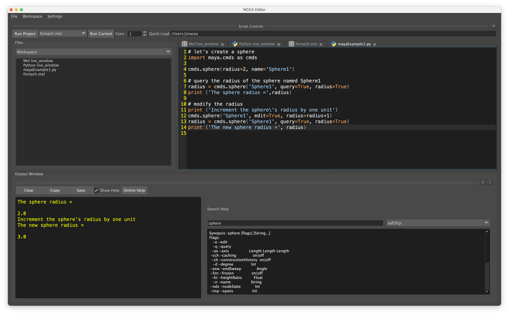

# Maya Editor


Maya 脚本编辑器的替代品正在进行中

使用 Python 3 编写，因此仅适用于使用 PySide2 在 Maya 2023 上进行更现代版本的 Maya 测试

请查看 [TODO.md](TODO.md) 路线图

## 安装中

该编辑器可以安装在我通常使用主目录的任何位置。

```
git clone [git@github.com:/Jeffreytsai1004/MayaEditor ](https://github.com/Jeffreytsai1004/MayaEditor)
```

如果您没有 git 帐户，您可以下载 zip 并解压。

有一个简单的 python 脚本来安装和创建 Maya 插件的模块文件。 它位于项目文件夹的根目录中，名为 **installEditor.py** 。 这将找到操作系统的模块文件夹并生成文件 MayaEditor.mod。 该文件位于以下位置之一的用户主文件夹中。

- Linux : $HOME/maya
- Mac : $HOME/Library/Preferences/Autodesk/maya
- Windows  %HOMEPATH%\\Documents\\maya\\

```
python3 ./installEditor.py
```


如果此安装不起作用，您可以编辑提供的文件并将路径修改为正确的位置

```
+ MayaEditor 1.0 /Users/jmacey/teaching/Code/MayaEditor
MAYA_PLUG_IN_PATH +:= plug-ins
```

## 加载

可以从插件管理器加载插件，如图所示


编辑器将自动加载并显示。 如果关闭窗口，可以使用以下代码重新打开它

```
import maya.cmds as cmds
cmds.MayaEditor()
```


